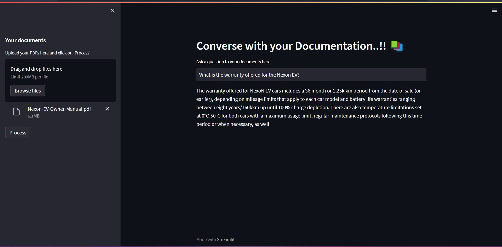

# Chat with your Documentation...!!!
-------------------------------------------
This project is inspired by the youtube video by [Alejandro AO - Software & Ai](https://www.youtube.com/watch?v=dXxQ0LR-3Hg) that uses OpenAI API to create a question answering chatbot that responds to user queries based on their documents.

My implementation of the project deviates from the original video in the following ways -
1. I am using locally installed instances of LLMs - Specifically GPT4ALL models for inference and Huggingface Embedding models (both through langchain)
2. I have incorporated a Chroma vector store to persist document texts and the embeddings to avoid re-ingesting the documents each time
3. I have tried out multiple GPT4ALL models as well as Huggingface text embedding models.
4. I have also kept code implementation (commented out) for doing the same through OpenAI API as well.

I have tried two approaches to implement this solution namely, The Conversation Chain with buffer memory as shown in the original video as well as a Retrieval QA chain approach.

## How It Works
------------



The application follows these steps to provide responses to your questions:

1. PDF Loading: The app reads multiple PDF documents and extracts their text content.

2. Text Chunking: The extracted text is divided into smaller chunks that can be processed effectively.

3. Language Model: The application utilizes a language model to generate vector representations (embeddings) of the text chunks.

4. Similarity Matching: When you ask a question, the app compares it with the text chunks and identifies the most semantically similar ones.

5. Response Generation: The selected chunks are passed to the language model, which generates a response based on the relevant content of the PDFs.

## Dependencies and Installation
----------------------------
To install the application, please follow these steps:

1. Clone the repository to your local machine.

2. Install the required dependencies by running the following command:
   ```
   pip install -r requirements.txt
   ```

3. Obtain an API key from OpenAI & Huggingface (If your are using OpenAI or Huggingface) and add it to the `.env` file in the project directory.

4. Please create the following directories in your local environment for storing the database and LLM models -
```
./model_cache
./documents_cache
./tmp_documents
./logs
```

## Usage
-----
To use the application, follow these steps:

1. Ensure that you have installed the required dependencies and added the API keys to the `.env` file (as required).

2. Run the `document_chat_retrieval_qa.py` file using the Streamlit CLI. Execute the following command:
   ```
   streamlit run document_chat_retrieval_qa.py
   ```

3. The application will launch in your default web browser, displaying the user interface.

4. Load multiple PDF documents into the app by following the provided instructions.

5. Ask questions in natural language about the loaded PDFs using the chat interface.

## Contributing
------------
This repository is intended for educational purposes and does not accept further contributions. Feel free to utilize and enhance the app based on your own requirements.

> Please note that running the GPT4ALL & Huggingface embedding models on local computer is very slow without a built in GPU with CUDA support. You will need to install the Cuda toolkit from Nvidia on supported machine and compile/install pytorch for cuda support in order to take advantage of GPU support.
